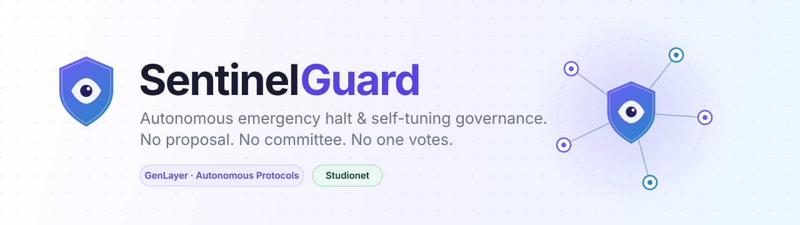
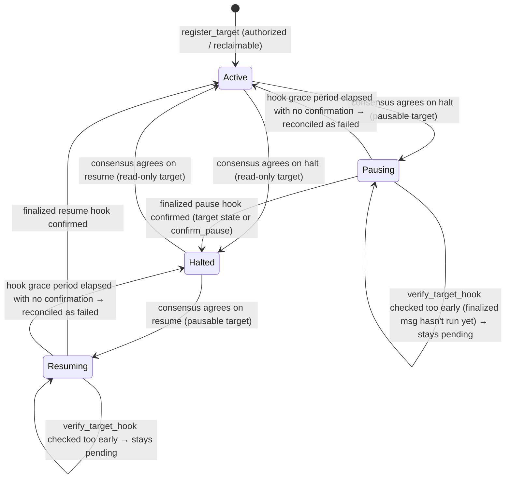

<div align="center">



<br />


**A guardian contract that halts other contracts when their own rules are broken —<br />and tunes its own sensitivity over time. No proposal. No committee. No one votes.**

[How it works](#-how-it-works) ·
[Self-tuning](#-it-tunes-itself) ·
[Security model](#-security-model) ·
[Contract API](#-contract-api) ·
[Integrate](#-make-your-contract-guardable) ·
[Quickstart](#-quickstart) ·
[Try the demo](#-try-the-demo)

</div>

---

## ✨ The idea

Emergency pauses in DeFi are usually a human process: someone notices, a multisig
scrambles, a vote happens — and by then the funds are gone. The alternative,
hard-coded circuit breakers, only catch the exact conditions someone thought of in
advance.

**SentinelGuard is a third option.** Any contract registers itself and writes its own
**rulebook in plain language** — *"no single withdrawal may exceed 10% of TVL"*,
*"the oracle price may not move more than 5% between reads"*. Anyone can then report
an incident with evidence. Validators read the rulebook against the evidence through
GenLayer's LLM-backed consensus, and if the verdict clears the target's own confidence
bar, the target is halted — permissionlessly, with no vote.

What makes it *autonomous* rather than merely *automated*:

- 🛑 **It pauses another contract** — no proposal, no vote, no admin key in the loop.
- 🎛️ **It rewrites its own rules** — the confidence bar for each target drifts up or
  down based on near-misses and false alarms, deterministically.
- 🔁 **It un-halts the same way** — a resume review runs through consensus with a
  differently-worded prompt, after a cooldown.

> Built for GenLayer's **Autonomous Protocols** track: *"systems that run themselves.
> If a contract pauses, tunes or rewrites another contract or its own rules with no
> one voting, it belongs here."* SentinelGuard does both halves in one contract.

## 🔍 How it works

```mermaid
sequenceDiagram
    autonumber
    actor R as Reporter
    participant S as SentinelGuard
    participant T as Target contract
    participant V as Validators (LLM consensus)

    Note over T,S: Target registered with target authorization or target-controlled reclaim path
    R->>S: report_incident(target, evidence) + GEN bond
    S->>T: Fetch authenticated target observation (view call on-chain)
    T-->>S: Return authenticated state (paused, balance, etc.)
    S->>V: rulebook + authenticated observation + evidence
    V-->>S: decision + confidence (validators MUST agree on thresholded action)
    alt decision = yes AND confidence ≥ target's bar (halt action agreed)
        alt target is pausable
            Note over S: status becomes "pausing" (guardian status does NOT change yet)
            S->)T: sentinel_pause() [on="finalized"]
            T->)S: confirm_pause() / verify_target_hook()
            Note over S: status changes to "halted" ONLY after verified (or reconciles to active on failure)
        else target is read-only
            Note over S: status changes to "halted" immediately
        end
        S-->>R: bond refunded, trust +5
    else decision = yes but below the bar (near-miss agreed)
        Note over S: bond forfeited, near-miss count +1
    else decision = no or uncertain (false alarm agreed)
        Note over S: bond forfeited, trust −3, false-alarm count +1
    end
```

A target's life is managed through safe transitions with hook verification and failure reconciliation:



`emit(on="finalized")` messages only execute once the appeal window has closed, so a
hook that hasn't run yet is not the same as a hook that failed. `verify_target_hook`
distinguishes the two: it only reconciles `Pausing`/`Resuming` back to
`Active`/`Halted` after `hook_grace_seconds()` (default 1 hour, owner-tunable within
5 min – 7 days) has elapsed with no confirmation — before that it just returns
`"pending"` and leaves guardian status untouched. If the finalized hook does arrive
late (after reconciliation already gave up on it), the next `confirm_pause` /
`confirm_resume` heals the mismatch instead of leaving the guard permanently out of
sync with the target.

**The important split:** the *only* non-deterministic step is the LLM verdict, and even
that is settled by validator consensus requiring agreement on the thresholded action. Everything after the
verdict — verifying the target hook, refunding or forfeiting the bond, nudging the bar,
adjusting trust — is plain deterministic bookkeeping.

## 🎛️ It tunes itself

Every registered target gets its own **confidence bar** (starts at **70**, clamped to
**40 – 95**). SentinelGuard moves it by itself:

| What happened | Effect on the contract |
|---|---|
| **3 near-misses** — the LLM said *yes*, but under the bar | Bar **−5** → more sensitive |
| **5 false alarms** — the LLM said *no* / *uncertain* | Bar **+5** → more tolerant |
| **A successful resume** after a real incident | Bar **+5** → learned caution |
| **A report that halts** a target | Reporter trust **+5** (max 100) |
| **A false-alarm report** | Reporter trust **−3**; below **10** you can no longer report |

No proposal, no vote, no admin transaction — the rule that governs future halts is
adjusted by the outcomes of past ones.

## 🛡️ Security model

Free reporting would break a self-tuning system: an attacker could spam junk evidence
from unlimited addresses and walk the bar to its ceiling at zero cost — so that a real
90%-confidence violation later gets rejected. SentinelGuard is designed around that.

| Threat | Defense |
|---|---|
| **Sybil spam to push the bar around** (either direction) | Every report is **payable**. The bond (default **2 GEN**) is refunded *only* when the report actually halts / resumes. Everything else — including a near-miss — forfeits it to the treasury. |
| **Unsubstantiated or fake evidence spam** | **Authenticated target observations**: SentinelGuard queries the target contract's actual on-chain state synchronously before calling consensus, wraps it with its own provenance (target address, which view answered, when), and truncates it to a bounded size. If the target exposes no readable state at all, reporting **fails closed** — evidence is never judged in isolation. |
| **Validators disagreeing across the action threshold** | **Thresholded action agreement**: Validators must agree on the actual action (halt vs no-halt), and the leader's proposal is shape-checked (decision must be a known label, confidence 0–100, reason bounded) before it's even compared. If one validator scores above the bar (e.g. 71 with bar 70) and another scores below (e.g. 69), consensus rejects even if the numeric difference is within tolerance. |
| **Target hijacking or unauthorized rulebook/pausable control** | **Target authorization & reclaim path**: only a caller the target itself vouches for (the target contract, its `is_sentinel_authorized`, or its `owner()`/`get_owner()`/`owner_address()`) may register it as **pausable**, edit its rulebook while halted/pending, or flip `pausable`. Anyone else may only register a **read-only** flag, which is marked `target_authorized=False` and never triggers a real pause hook. The target (or its verified owner) can call `reclaim_target_control` **at any time** to take registrar authority back from a third party, which also clears any read-only halt that third party raised without real authority. |
| **Racing the finalized pause/resume hook** | Guardian status changes to `halted` / `active` **only** once the target's own state confirms the hook (or the target calls `confirm_pause`/`confirm_resume`) — never just because `report_incident`/`request_resume_review` was accepted, and never because `verify_target_hook` was called before the finalized message actually ran. Checking too early returns `"pending"` and leaves status untouched; only after a grace period with no confirmation does it reconcile as failed. |
| **Silent pause/resume hook failures** | If the hook genuinely reverts (or the target never implements it), `verify_target_hook` reconciles `Pausing`→`Active` / `Resuming`→`Halted` once the grace period has elapsed — the guard never claims a halt/resume that didn't happen, and the incident record is marked `"failed"` so integrators can see it. |
| **Low-quality repeat reporters** | On-chain **reporter trust** (starts at 50). False alarms cost trust; under 10 you can't report. |
| **Prompt injection through evidence or rulebook** | Untrusted text is neutralised (`<` `>` replaced) before entering the prompt, the prompt states that everything inside the markers is *data*, and the model must answer in strict JSON that is validated field by field on both leader and validator sides. |
| **Malformed model output** | One automatic retry, then a typed `[LLM_ERROR]` — never silently turned into a business decision. |
| **A target rewriting its rules to dodge a live incident** | `update_rulebook` from a third-party registrar is only allowed while the target is `active` (not halted, not mid-verification); the target itself may always fix its own rulebook except while a hook is actually in flight. |
| **Premature un-halting** | 5-minute resume cooldown, plus a separate prompt that must see evidence the *specific* original problem is gone. |

The owner's powers are deliberately narrow: tune the bond amount, tune how long a
finalized hook may stay unconfirmed before it's treated as failed (bounded to
5 minutes – 7 days), and sweep forfeited bonds from the treasury. The owner **cannot**
change any adjudication outcome, and cannot touch a specific target's rulebook,
pausable flag, or registration — only the target (or whoever it authorizes) can.

## 📜 Contract API

**Writes**

| Method | Who | What it does |
|---|---|---|
| `register_target(target, rulebook, pausable)` | anyone, if `pausable` then target-authorized | Registers a contract with a 20–1000 char rulebook. `pausable=True` requires target authorization (target itself, its `is_sentinel_authorized`, or its `owner()`); anyone may register `pausable=False` (read-only status flag). |
| `update_rulebook(target, rulebook)` | target/authorized, or third-party registrar while `active` | Replaces the rulebook. Always blocked while a hook is in flight (`pausing`/`resuming`). |
| `set_pausable(target, pausable)` | target-authorized only | Flips whether SentinelGuard is allowed to actually call the pause/resume hooks. Only while `active`. |
| `reclaim_target_control(target, new_controller)` | target contract / target owner | Target-controlled reclaim path: takes registrar authority back from any third party at any time, and clears a read-only halt that third party raised without real authority. |
| `report_incident(target, evidence)` 💰 | anyone (trust ≥ 10) | Bond + evidence → fetches an authenticated target observation (fails closed if unreadable) → consensus on the thresholded action → transitions to `pausing` / `halted`. |
| `request_resume_review(target, evidence)` 💰 | anyone, after cooldown | Same pipeline as above → transitions to `resuming` / `active`. |
| `verify_target_hook(target)` | anyone | Checks the target's own state for the pending pause/resume hook. Too early → `"pending"` (status untouched). Confirmed → transitions status. Grace period elapsed with no confirmation → `"reconciled_failure"` (status reverted, never claims a hook that didn't happen). |
| `confirm_pause(target)` / `confirm_resume(target)` | target contract only | Finalized callback the target emits after its hook actually ran; also heals a mismatch if it arrives after a `reconciled_failure`. |
| `set_incident_bond(amount)` | owner | Tunes the required bond. |
| `set_hook_grace(seconds)` | owner | Tunes how long a pending hook may stay unconfirmed before `verify_target_hook` reconciles it as failed (5 min – 7 days). |
| `withdraw_treasury(to, amount)` | owner | Sweeps forfeited bonds. |

**Reads** (all free, all work without a wallet)

`status(target)` (`"active"` \| `"halted"` \| `"pausing"` \| `"resuming"`) · `get_target(target)` · `list_targets(n)` · `get_incident(id)` ·
`recent_incidents(n)` · `reporter_trust(address)` · `reporter_incident_count(address)` ·
`reporter_latest_incident(address)` · `incident_bond_amount()` · `hook_grace_seconds()` ·
`treasury_balance()` · `stats()`

> 💡 `status(target)` is a public halt flag. Other protocols, agents and frontends can
> check it **before** interacting with a target — the same pattern oracle-consuming
> contracts already use — even if the target isn't pausable.
>
> 💡 `reporter_latest_incident(address)` is what the frontend uses to correlate a
> submitted transaction with the exact incident it created — a write receipt doesn't
> reliably expose a contract method's return value, so this view exists specifically
> so the client never has to guess (e.g. "assume it's the most recent incident").

## 🔌 Make your contract guardable

A target contract opts in with authenticated observations, authorization, and hooks (see [`contracts/demo_vault.py`](contracts/demo_vault.py)):

```python
class MyProtocol(gl.Contract):
    owner_addr: Address        # not named `owner` if you also add an owner() view - avoid the name clash
    sentinel: Address          # 1. SentinelGuard's address, set at deploy time
    paused: bool

    def __init__(self, sentinel: str):
        self.owner_addr = gl.message.sender_address
        self.sentinel = Address(sentinel)
        self.paused = False

    def _require_sentinel(self) -> None:
        if gl.message.sender_address != self.sentinel:
            raise gl.vm.UserError("[EXPECTED] not sentinel")

    @gl.public.view
    def sentinel_observe(self) -> str:     # 2. Authenticated target observation
        return json.dumps({"target": gl.message.contract_address.as_hex, "is_paused": self.paused})

    @gl.public.view
    def is_sentinel_authorized(self, addr: str) -> bool:  # 3. Target authorization
        return Address(addr) == self.owner_addr           #    (only the target's own owner)

    @gl.public.write
    def sentinel_pause(self) -> None:      # 4. Only SentinelGuard may pause…
        self._require_sentinel()
        self.paused = True
        gl.get_contract_at(self.sentinel).emit(on="finalized").confirm_pause(
            gl.message.contract_address.as_hex
        )

    @gl.public.write
    def sentinel_resume(self) -> None:     # 5. …and only SentinelGuard may resume
        self._require_sentinel()
        self.paused = False
        gl.get_contract_at(self.sentinel).emit(on="finalized").confirm_resume(
            gl.message.contract_address.as_hex
        )

    # Every state-changing method starts with: if self.paused: raise ...
```

Then call `register_target(address, rulebook, True)` **as the owner (or another address
your `is_sentinel_authorized` approves)** — anyone else attempting `pausable=True` is
rejected. Not pausable, or registering someone else's contract for visibility only?
Register with `pausable=False` and you still get a first-class, publicly readable halt
flag that never touches the target's state.

### What SentinelGuard deliberately does *not* do

Nothing on any chain can force a foreign contract to change state, and SentinelGuard
doesn't pretend otherwise. If a target claims `pausable=True` but doesn't implement
the hooks, the pause call fails — and the incident record still sits on-chain, so
integrators can see it was never enforced. Registration is permissionless, but
registering a contract you don't control gives you no power over it.

## 🚀 Quickstart

### Deployed

Not currently deployed. The contract's storage layout changed (registration
authorization, hook grace-period reconciliation, per-reporter incident index), so any
prior deployment is incompatible — run the deploy script below, then paste the two
resulting addresses into
[`frontend/src/config/network.js`](frontend/src/config/network.js).

### Run the frontend

```bash
cd frontend
npm install
npm run dev          # http://localhost:5173
npm run build        # static dist/ — deploy anywhere
```

Pure client-side React + Vite: no server, everything talks to the chain directly via
`genlayer-js`. Reads (dashboard, target lookups) work with **no wallet connected**.
Connecting opens a wallet picker (EIP-6963), adds the network if needed, and switches
to it.

### Deploy the contracts yourself

```bash
pip install -r requirements.txt
python scripts/deploy.py --network studionet
```

The script creates an account (key saved to a git-ignored `.env`), tops it up from the
faucet, deploys both contracts, wires `DemoVault` to `SentinelGuard`, registers the
vault with a sample rulebook, and writes every address to `deployed.<network>.json`.
Paste the addresses into [`frontend/src/config/network.js`](frontend/src/config/network.js).

| Network | Chain | `genlayer-py` | Fee deposit on writes |
|---|---|---|---|
| `studionet` | 61999 | `0.18.*` | none |
| `studio-next` | 61997 | `0.19.0rc2` | yes (consensus v0.6) |

Only one `genlayer-py` line can be installed at a time — `requirements.txt` lists both
pins, so switch which line is active for your network. The **contract code is identical** on every
network; only deploy tooling differs. See the docstring in
[`scripts/deploy.py`](scripts/deploy.py) for the `studio-next` fee-estimation caveat.

## 🧪 Try the demo

1. Open the app and **connect a wallet** — it switches to Studionet for you.
2. Under **Targets**, pick the deployed **DemoVault** and read its rulebook.
3. In **Report, review, resume**, file an incident with the 2 GEN bond, e.g.
   *"Logs show withdraw(5000) executed while get_balance() returned 1200 — the vault paid out more than it held."*
4. Validators adjudicate. If the verdict clears the bar, the vault is **halted** and your
   bond comes back; watch its confidence bar and your trust score move.
5. Wait out the 5-minute cooldown, then submit **resolution evidence** to request a
   resume review.

## 🧪 Run the tests

```bash
# Contract logic — executes the real contracts/sentinel_guard.py and
# demo_vault.py against a GenLayer-style direct-mode harness
# (tests/genlayer_direct_harness.py), covering threshold-boundary consensus,
# the finalized-hook race, hook-failure reconciliation, and authorization.
python3 -m unittest tests.test_sentinel_guard -v

# Client correlation/consistency logic — imports the real, SDK-free helpers
# from frontend/src/lib/correlate.js (the same module useSentinelClient.js
# calls), not a re-implementation.
node tests/test_client_correlation.js
```

## 🗂️ Repository layout

```
SentinelGuard/
├── contracts/
│   ├── sentinel_guard.py    the guardian — adjudication, bonds, self-tuning
│   └── demo_vault.py        a toy target that opts in to being paused
├── scripts/
│   └── deploy.py            deploys both, wires them, registers a demo target
├── tests/
│   ├── genlayer_direct_harness.py   minimal direct-mode harness (see its docstring)
│   ├── test_sentinel_guard.py       contract tests, run with `python3 -m unittest`
│   └── test_client_correlation.js   client-side correlation/consistency tests
├── frontend/                React + Vite dApp (see frontend/README.md)
│   └── src/lib/correlate.js pure client verification/correlation logic (tested directly)
├── assets/                  README artwork
└── requirements.txt         genlayer-py, pinned per network
```

## ⚠️ Status

A hackathon build on a GenLayer test network. It has **not been audited** — don't put
real funds behind it.

## 🔗 Links

- **Source:** [github.com/reza9133/SentinelGuard](https://github.com/reza9133/SentinelGuard)
- **Builder:** [@amirhp771](https://x.com/amirhp771) on X
- **GenLayer docs:** [docs.genlayer.com](https://docs.genlayer.com)
