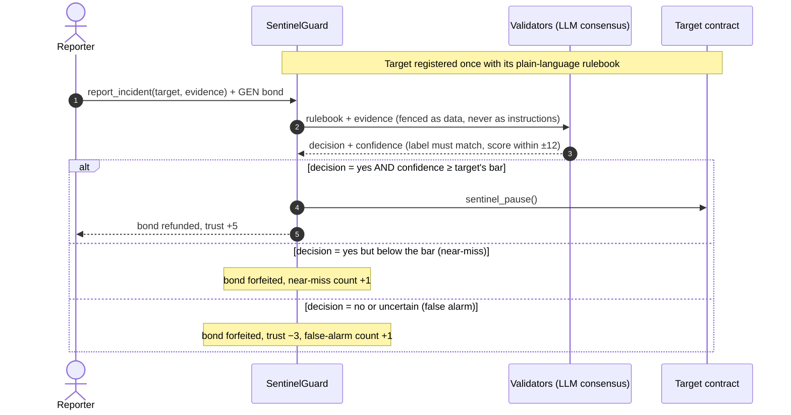
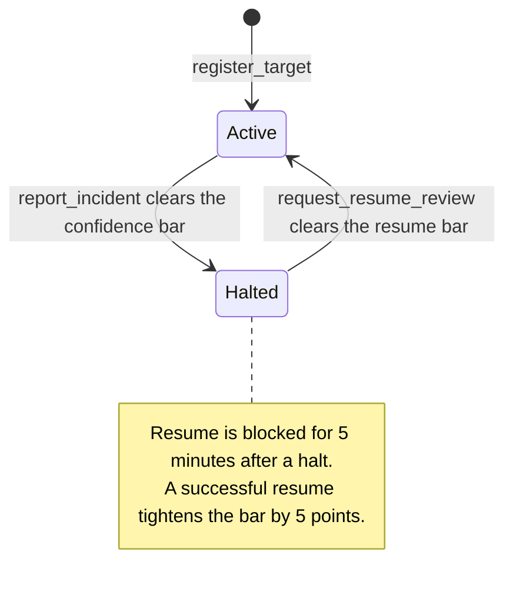

<div align="center">


<br />


**A guardian contract that halts other contracts when their own rules are broken —<br />and tunes its own sensitivity over time. No proposal. No committee. No one votes.**

[How it works](#-how-it-works) ·
[Self-tuning](#-it-tunes-itself) ·
[Security model](#-security-model) ·
[Contract API](#-contract-api) ·
[Integrate](#-make-your-contract-guardable) ·
[Quickstart](#-quickstart) ·
[Try the demo](#-try-the-demo)

</div>

---

## ✨ The idea

Emergency pauses in DeFi are usually a human process: someone notices, a multisig
scrambles, a vote happens — and by then the funds are gone. The alternative,
hard-coded circuit breakers, only catch the exact conditions someone thought of in
advance.

**SentinelGuard is a third option.** Any contract registers itself and writes its own
**rulebook in plain language** — *"no single withdrawal may exceed 10% of TVL"*,
*"the oracle price may not move more than 5% between reads"*. Anyone can then report
an incident with evidence. Validators read the rulebook against the evidence through
GenLayer's LLM-backed consensus, and if the verdict clears the target's own confidence
bar, the target is halted — permissionlessly, with no vote.

What makes it *autonomous* rather than merely *automated*:

- 🛑 **It pauses another contract** — no proposal, no vote, no admin key in the loop.
- 🎛️ **It rewrites its own rules** — the confidence bar for each target drifts up or
  down based on near-misses and false alarms, deterministically.
- 🔁 **It un-halts the same way** — a resume review runs through consensus with a
  differently-worded prompt, after a cooldown.

> Built for GenLayer's **Autonomous Protocols** track: *"systems that run themselves.
> If a contract pauses, tunes or rewrites another contract or its own rules with no
> one voting, it belongs here."* SentinelGuard does both halves in one contract.

## 🔍 How it works



A target's life is a two-state machine, and both transitions go through consensus:



**The important split:** the *only* non-deterministic step is the LLM verdict, and even
that is settled by validator consensus, not by any single model. Everything after the
verdict — pausing the target, refunding or forfeiting the bond, nudging the bar,
adjusting trust — is plain deterministic bookkeeping.

## 🎛️ It tunes itself

Every registered target gets its own **confidence bar** (starts at **70**, clamped to
**40 – 95**). SentinelGuard moves it by itself:

| What happened | Effect on the contract |
|---|---|
| **3 near-misses** — the LLM said *yes*, but under the bar | Bar **−5** → more sensitive |
| **5 false alarms** — the LLM said *no* / *uncertain* | Bar **+5** → more tolerant |
| **A successful resume** after a real incident | Bar **+5** → learned caution |
| **A report that halts** a target | Reporter trust **+5** (max 100) |
| **A false-alarm report** | Reporter trust **−3**; below **10** you can no longer report |

No proposal, no vote, no admin transaction — the rule that governs future halts is
adjusted by the outcomes of past ones.

## 🛡️ Security model

Free reporting would break a self-tuning system: an attacker could spam junk evidence
from unlimited addresses and walk the bar to its ceiling at zero cost — so that a real
90%-confidence violation later gets rejected. SentinelGuard is designed around that.

| Threat | Defense |
|---|---|
| **Sybil spam to push the bar around** (either direction) | Every report is **payable**. The bond (default **2 GEN**) is refunded *only* when the report actually halts / resumes. Everything else — including a near-miss — forfeits it to the treasury. |
| **Low-quality repeat reporters** | On-chain **reporter trust** (starts at 50). False alarms cost trust; under 10 you can't report. |
| **Prompt injection through evidence or rulebook** | Untrusted text is neutralised (`<` `>` replaced) before entering the prompt, the prompt states that everything inside the markers is *data*, and the model must answer in strict JSON that is validated field by field. |
| **Validator LLMs disagreeing by a few points** | The decision label (`yes` / `no` / `uncertain`) must match **exactly**; only the numeric confidence gets a **±12** tolerance. Without it nearly every report would end undetermined. |
| **Malformed model output** | One automatic retry, then a typed `[LLM_ERROR]` — never silently turned into a business decision. |
| **A target rewriting its rules to dodge a live incident** | `update_rulebook` is registrar-only and **blocked while the target is halted**. |
| **Premature un-halting** | 5-minute resume cooldown, plus a separate prompt that must see evidence the *specific* original problem is gone. |
| **Forcing state changes on other contracts** | Impossible by design — targets **opt in** with hooks that only accept calls from SentinelGuard's address (see below). |

The owner's powers are deliberately narrow: tune the bond amount and sweep forfeited
bonds from the treasury. The owner **cannot** change any adjudication outcome.

## 📜 Contract API

**Writes**

| Method | Who | What it does |
|---|---|---|
| `register_target(target, rulebook, pausable)` | anyone | Registers a contract with a 20–1000 char rulebook. `pausable=True` promises the `sentinel_*` hooks exist. |
| `update_rulebook(target, rulebook)` | registrar, only while active | Replaces the rulebook. |
| `report_incident(target, evidence)` 💰 | anyone (trust ≥ 10) | Bond + evidence (≤ 2000 chars) → consensus verdict → halt / near-miss / false alarm. |
| `request_resume_review(target, evidence)` 💰 | anyone, after cooldown | Evidence the problem is resolved → consensus verdict → resume or forfeit. |
| `set_incident_bond(amount)` | owner | Tunes the required bond. |
| `withdraw_treasury(to, amount)` | owner | Sweeps forfeited bonds. |

**Reads** (all free, all work without a wallet)

`status(target)` · `get_target(target)` · `list_targets(n)` · `get_incident(id)` ·
`recent_incidents(n)` · `reporter_trust(address)` · `incident_bond_amount()` ·
`treasury_balance()` · `stats()`

> 💡 `status(target)` is a public halt flag. Other protocols, agents and frontends can
> check it **before** interacting with a target — the same pattern oracle-consuming
> contracts already use — even if the target isn't pausable.

## 🔌 Make your contract guardable

A target needs exactly three things (see [`contracts/demo_vault.py`](contracts/demo_vault.py)):

```python
class MyProtocol(gl.Contract):
    sentinel: Address          # 1. SentinelGuard's address, set at deploy time
    paused: bool

    def __init__(self, sentinel: str):
        self.sentinel = Address(sentinel)
        self.paused = False

    def _require_sentinel(self) -> None:
        if gl.message.sender_address != self.sentinel:
            raise gl.vm.UserError("[EXPECTED] not sentinel")

    @gl.public.write
    def sentinel_pause(self) -> None:      # 2. only SentinelGuard may pause…
        self._require_sentinel()
        self.paused = True

    @gl.public.write
    def sentinel_resume(self) -> None:     # 3. …and only SentinelGuard may resume
        self._require_sentinel()
        self.paused = False

    # every state-changing method then starts with:  if self.paused: raise …
```

Then call `register_target(address, rulebook, True)`. Not pausable? Register with
`pausable=False` and you still get a first-class, publicly readable halt flag.

### What SentinelGuard deliberately does *not* do

Nothing on any chain can force a foreign contract to change state, and SentinelGuard
doesn't pretend otherwise. If a target claims `pausable=True` but doesn't implement
the hooks, the pause call fails — and the incident record still sits on-chain, so
integrators can see it was never enforced. Registration is permissionless, but
registering a contract you don't control gives you no power over it.

## 🚀 Quickstart

### Deployed (Studionet · chain 61999)

| Contract | Address |
|---|---|
| **SentinelGuard** | `0xdF396341809A2A3d1A4E1149D14FBdB5856BCD2E` |
| **DemoVault** | `0x5e04809a896C5e04D97406b955a9bFf725230239` |

### Run the frontend

```bash
cd frontend
npm install
npm run dev          # http://localhost:5173
npm run build        # static dist/ — deploy anywhere
```

Pure client-side React + Vite: no server, everything talks to the chain directly via
`genlayer-js`. Reads (dashboard, target lookups) work with **no wallet connected**.
Connecting opens a wallet picker (EIP-6963), adds the network if needed, and switches
to it.

### Deploy the contracts yourself

```bash
pip install -r requirements.txt
python scripts/deploy.py --network studionet
```

The script creates an account (key saved to a git-ignored `.env`), tops it up from the
faucet, deploys both contracts, wires `DemoVault` to `SentinelGuard`, registers the
vault with a sample rulebook, and writes every address to `deployed.<network>.json`.
Paste the addresses into [`frontend/src/config/network.js`](frontend/src/config/network.js).

| Network | Chain | `genlayer-py` | Fee deposit on writes |
|---|---|---|---|
| `studionet` | 61999 | `0.18.*` | none |
| `studio-next` | 61997 | `0.19.0rc2` | yes (consensus v0.6) |

Only one `genlayer-py` line can be installed at a time — `requirements.txt` lists both
pins, so switch which line is active for your network. The **contract code is identical** on every
network; only deploy tooling differs. See the docstring in
[`scripts/deploy.py`](scripts/deploy.py) for the `studio-next` fee-estimation caveat.

## 🧪 Try the demo

1. Open the app and **connect a wallet** — it switches to Studionet for you.
2. Under **Targets**, pick the deployed **DemoVault** and read its rulebook.
3. In **Report, review, resume**, file an incident with the 2 GEN bond, e.g.
   *"Logs show withdraw(5000) executed while get_balance() returned 1200 — the vault paid out more than it held."*
4. Validators adjudicate. If the verdict clears the bar, the vault is **halted** and your
   bond comes back; watch its confidence bar and your trust score move.
5. Wait out the 5-minute cooldown, then submit **resolution evidence** to request a
   resume review.

## 🗂️ Repository layout

```
SentinelGuard/
├── contracts/
│   ├── sentinel_guard.py    the guardian — adjudication, bonds, self-tuning
│   └── demo_vault.py        a toy target that opts in to being paused
├── scripts/
│   └── deploy.py            deploys both, wires them, registers a demo target
├── frontend/                React + Vite dApp (see frontend/README.md)
├── assets/                  README artwork
└── requirements.txt         genlayer-py, pinned per network
```

## ⚠️ Status

A hackathon build on a GenLayer test network. It has **not been audited** — don't put
real funds behind it.

## 🔗 Links

- **Source:** [github.com/reza9133/SentinelGuard](https://github.com/reza9133/SentinelGuard)
- **Builder:** [@amirhp771](https://x.com/amirhp771) on X
- **GenLayer docs:** [docs.genlayer.com](https://docs.genlayer.com)
